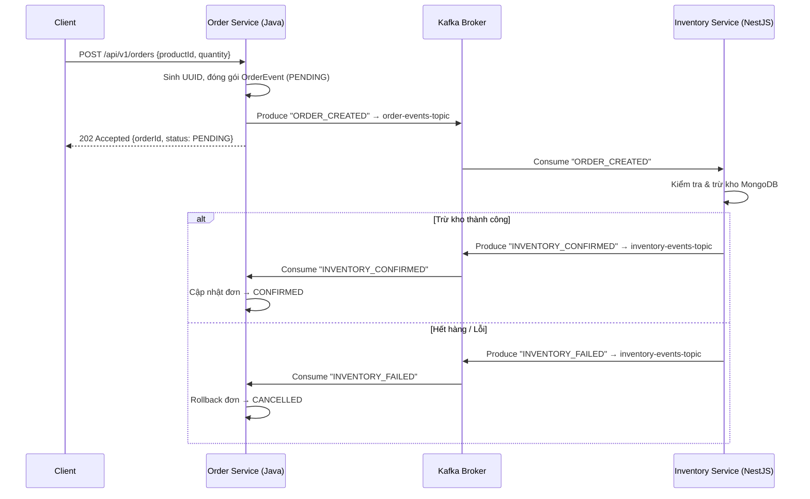

# Order Service — Kafka & Saga Flow

Chi tiết luồng giao tiếp Kafka của Order Service trong chuỗi Saga Choreography.

---

## 🔄 Luồng Saga Choreography (Event-Driven)

---

## 📦 Cấu trúc Event (Generated từ AsyncAPI)

*Lưu ý: Các model được sinh tự động bởi ZenWave SDK Maven Plugin dựa trên `shared/event-schemas/asyncapi.yaml`.*

**OrderEventPayload (Gửi đi):**
| Trường      | Kiểu   | Mô tả                                                      |
| :---------- | :----- | :---------------------------------------------------------- |
| `orderId`   | String | UUID duy nhất cho mỗi đơn hàng (Key Kafka).                |
| `productId` | String | Mã sản phẩm khách đặt.                                     |
| `quantity`  | int    | Số lượng yêu cầu.                                          |
| `status`    | Enum   | `PENDING`, `CONFIRMED`, `CANCELLED`, `FAILED`.             |
| `eventType` | Enum   | `ORDER_CREATED`, `INVENTORY_CONFIRMED`, `INVENTORY_FAILED`.|

**InventoryResponsePayload (Nhận về):** Tương tự nhưng có thêm trường `message` (String) mô tả kết quả xử lý từ kho.

---

## 🛡️ Kafka Topics sử dụng

| Topic                      | Producer         | Consumer          | Mục đích                           |
| :------------------------- | :--------------- | :---------------- | :--------------------------------- |
| `order-events-topic`       | Order Service    | Inventory Service | Gửi yêu cầu trừ kho khi có đơn.   |
| `inventory-events-topic`    | Inventory Service| Order Service     | Phản hồi kết quả trừ kho (OK/Fail).|

---

## ⚙️ Các Class chính

### `KafkaTopicConfig.java`
- Khai báo Bean `NewTopic` để Spring Boot tự động tạo topic `order-events-topic` (3 partitions, 1 replica) trên Kafka khi ứng dụng khởi động.

### `OrderProducerService.java`
- Sử dụng `KafkaTemplate<String, OrderEventPayload>` gửi message bất đồng bộ.
- Dùng `orderId` làm **Partition Key** để đảm bảo mọi event liên quan đến cùng một đơn hàng luôn vào cùng Partition → giữ đúng thứ tự xử lý.

### `OrderController.java`
- Endpoint `POST /api/v1/orders` nhận JSON `{productId, quantity}`.
- Tạo UUID, sử dụng Builder pattern đóng gói `OrderEventPayload`, gửi Kafka, trả `202 Accepted` ngay lập tức.

### `InventoryResponseConsumer.java`
- `@KafkaListener` trên topic `inventory-events-topic`.
- Nhận phản hồi `INVENTORY_CONFIRMED` hoặc `INVENTORY_FAILED` từ Inventory và xử lý Saga rollback/confirm.

---

## 🤖 Code Generation với ZenWave SDK

Order Service áp dụng triết lý **API-First Development** thông qua file thiết kế chung `shared/event-schemas/asyncapi.yaml` (Source of Truth). Dựa vào thiết kế này, **ZenWave SDK Maven Plugin** sẽ tự động sinh mã nguồn (Code Generation) mỗi khi chạy lệnh build (`mvn compile`).

### 1. Tại sao lại dùng Code Generation?
- **Đảm bảo đồng bộ**: Code Java luôn khớp 100% với tài liệu thiết kế gốc. Không có chuyện tài liệu một đằng, code viết một nẻo.
- **Tiết kiệm thời gian**: Lập trình viên không cần viết tay hàng loạt các class DTO (POJO) nhàm chán như getter, setter, builder, equals, hashCode.
- **An toàn kiểu dữ liệu (Type-Safety)**: Các cấu trúc dữ liệu, enum (VD: `Status.PENDING`) đươc sinh ra chính xác. IDE có thể gợi ý mã thay vì gõ sai chuỗi String (Magic Strings).

### 2. Chi tiết các thành phần được sinh tự động
Thay vì tồn tại trong thư mục `src/main/java`, các file này hiện diện trong thư mục `target/generated-sources/zenwave/` và được cấu hình để IDE nhận diện như source thông thường.

#### 📦 Models (DTOs)
- Nằm trong package: `com.nexus.orderservice.events.model`
- **Ví dụ**: `OrderEventPayload.java`, `InventoryResponsePayload.java`.
- **Đặc điểm**:
  - Hỗ trợ **Builder Pattern** (như `new OrderEventPayload().withOrderId(...)`).
  - Bao gồm các `@NotNull`, `@DecimalMin` mapping trực tiếp từ ràng buộc của AsyncAPI schema.
  - Sinh sẵn các enum an toàn (VD: `EventType.ORDER_CREATED`).

#### 📤 Producers (Interfaces)
- Nằm trong package: `com.nexus.orderservice.events.producer`
- **Ví dụ**: `DefaultServiceEventsProducer.java`
- **Đặc điểm**:
  - Tự động sinh ra interface chứa các phương thức như `sendOrderEvents(OrderEventPayload payload)`.
  - Spring Cloud Stream sẽ dựa vào interface này để tạo bean tương ứng gửi message lên Kafka đúng Topic đã quy định.
  - Tự động đóng gói đúng Message Struct và Headers.

#### 📥 Consumers (Interfaces)
- Nằm trong package: `com.nexus.orderservice.events.consumer`
- **Ví dụ**: `IProcessOrderEventsConsumerService.java`, `IProcessInventoryResponseConsumerService.java`
- **Đặc điểm**:
  - Tạo sẵn hợp đồng (interface) yêu cầu lập trình viên implement hàm xử lý logic (ví dụ `processInventoryResponse`).
  - Đi kèm với một lớp Consumer base (`ProcessInventoryResponseConsumer.java`) tự động làm nhiệm vụ deserialize JSON thành Java Object và định tuyến đến logic kinh doanh mà bạn không cần phải làm tay.
  - Hỗ trợ xử lý lỗi tích hợp sẵn (Dead Letter Queue routing).

### 3. Cách thức cấu hình trong `pom.xml`
ZenWave plugin hoạt động theo 2 pha (`executions`):
1. `<id>generate-asyncapi-dtos</id>`: Gọi generator `jsonschema2pojo` để parse `asyncapi.yaml` thành các lớp Model.
2. `<id>generate-asyncapi-producer</id>`: Gọi generator `spring-cloud-streams3` dùng các mô hình ở pha 1 để tiếp tục sinh ra các Producer/Consumer interface, định nghĩa cơ chế Pub/Sub trên Kafka.
