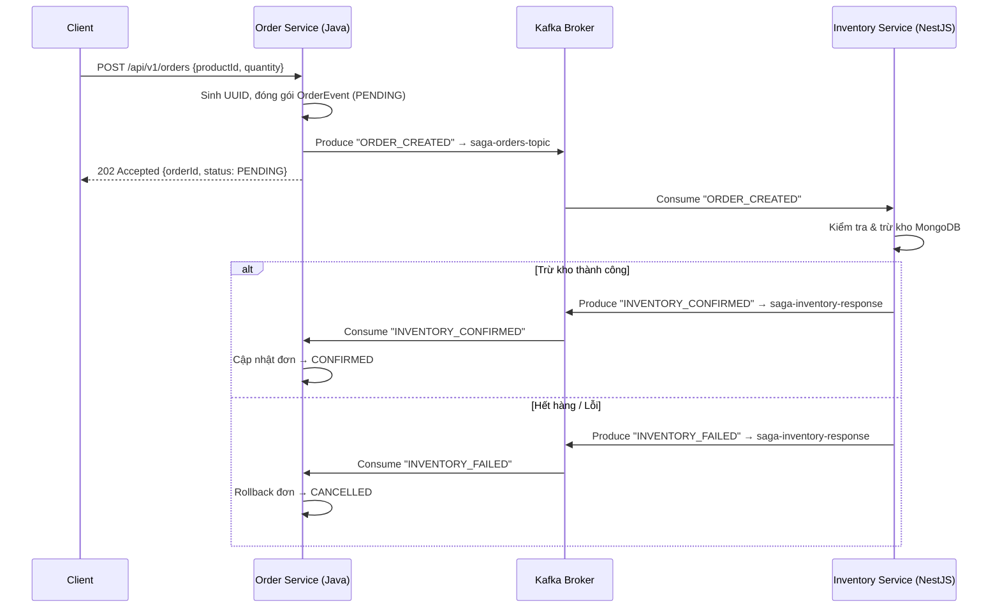

# Order Service — Kafka & Saga Flow

Chi tiết luồng giao tiếp Kafka của Order Service trong chuỗi Saga Choreography.

---

## 🔄 Luồng Saga Choreography (Event-Driven)

---

## 📦 Cấu trúc Event (OrderEvent DTO)

| Trường      | Kiểu   | Mô tả                                                      |
| :---------- | :----- | :---------------------------------------------------------- |
| `orderId`   | String | UUID duy nhất cho mỗi đơn hàng.                            |
| `productId` | String | Mã sản phẩm khách đặt.                                     |
| `quantity`  | int    | Số lượng yêu cầu.                                          |
| `status`    | String | `PENDING` / `CONFIRMED` / `CANCELLED`.                     |
| `eventType` | String | `ORDER_CREATED` / `ORDER_CANCELLED` (loại sự kiện Saga).   |

---

## 🛡️ Kafka Topics sử dụng

| Topic                      | Producer         | Consumer          | Mục đích                           |
| :------------------------- | :--------------- | :---------------- | :--------------------------------- |
| `saga-orders-topic`        | Order Service    | Inventory Service | Gửi yêu cầu trừ kho khi có đơn.   |
| `saga-inventory-response`  | Inventory Service| Order Service     | Phản hồi kết quả trừ kho (OK/Fail).|

---

## ⚙️ Các Class chính

### `KafkaTopicConfig.java`
- Khai báo Bean `NewTopic` để Spring Boot tự động tạo topic `saga-orders-topic` (3 partitions, 1 replica) trên Kafka khi ứng dụng khởi động.

### `OrderProducerService.java`
- Sử dụng `KafkaTemplate<String, OrderEvent>` gửi message bất đồng bộ.
- Dùng `orderId` làm **Partition Key** để đảm bảo mọi event liên quan đến cùng một đơn hàng luôn vào cùng Partition → giữ đúng thứ tự xử lý.

### `OrderController.java`
- Endpoint `POST /api/v1/orders` nhận JSON `{productId, quantity}`.
- Tạo UUID, đóng gói `OrderEvent`, gửi Kafka, trả `202 Accepted` ngay lập tức.

### `InventoryResponseConsumer.java`
- `@KafkaListener` trên topic `saga-inventory-response`.
- Nhận phản hồi `INVENTORY_CONFIRMED` hoặc `INVENTORY_FAILED` từ Inventory và xử lý Saga rollback/confirm.
